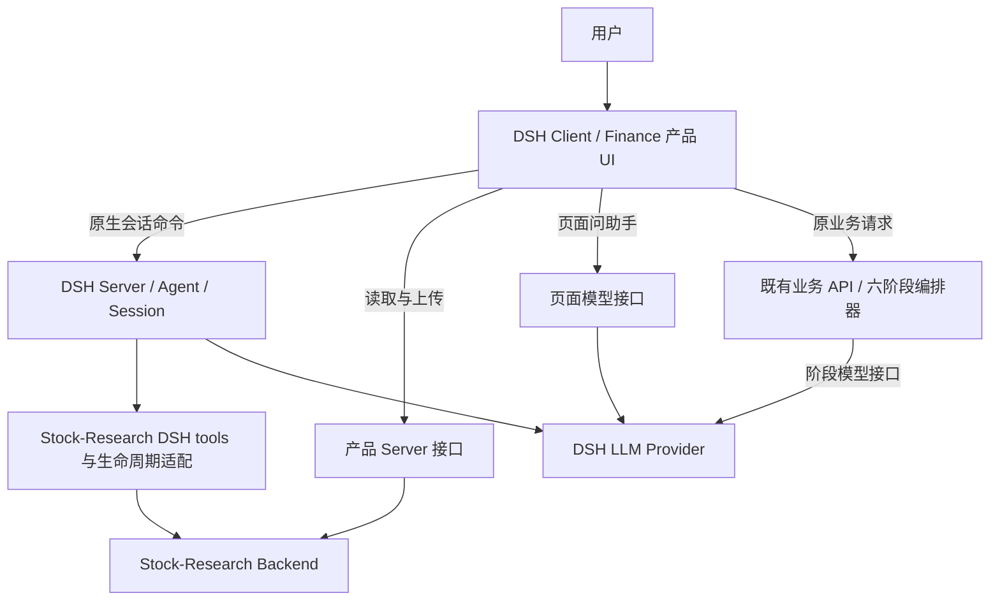
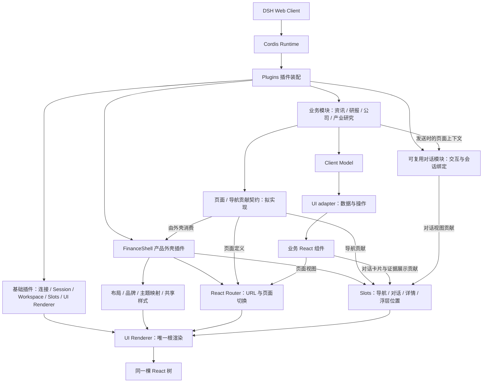

# M6 · 架构边界与 UI 组合方案

日期：2026-09-09；边界同步：2026-09-10。状态：目标设计；Web Client 组合与对话 Owner 已确认并归入 [M4](研究闭环与DSH交互_M4_2026-09-08.md)；M6-A 有界收敛已实施、真实运行待验收，其余接口与实施方案仍待审阅。代码已分批提交，验证范围见 M6-B；未打包、未推送。

## 1. 目标与授权

用户同意先做有界基础收敛，再做证据锚点和交互成果；本轮要求给出架构、布局、样式与 UI slot 方案。这里只记录设计，不视为新增接口或重构实施已获批准。
本方案承接 [M3](默认Agent与DSH模型配置_M3_2026-09-08.md) 的运行基础与 [M5](产品界面与交互收敛_M5_2026-09-09.md) 的组合边界工作；M5 继续负责体验缺陷，M4 继续负责研究业务闭环。
决定入口为 [Human Checklist](../human-checklist.md)。本草案不成为第二份研究契约，不追认 M3–M5 全部通过验收。

## 2. 当前架构判断

**宿主层已经是 DSH 双端插件与 UI slot 架构；业务组合层仍是 slot 与 React Router 混合实现。**
Slot 是模块的装配和生命周期边界，里面仍是普通 React 组件；按钮、卡片、每个页面都变成 slot 并不是目标。

| 当前事实 | 源码证据 | 含义 |
| --- | --- | --- |
| Node 安装产品和研究插件；产品有 server/client 两个入口 | `desktop/dsh/setup.ts`、`desktop/dsh/finance-ui/package.json` | 已走正式 Loader，不应再造插件加载器 |
| 产品显式禁用原生 ui-layout/ui-sidebar，占用 root | `desktop/dsh/finance-ui/cordis.patch.yml` | Finance 必须承担被替换布局的完整组合责任 |
| root 声明 sidebar、conversation、details、shell.overlay | `desktop/src/verticals/finance/dsh/client.tsx` | 已有原生 slot 树，不是整个 DSH 被放入 iframe |
| DOM ID + Portal 将原生会话和设置放进 Layout | `dsh/NativeDsh.tsx`、`components/layout/Layout.tsx` | 能用，但渲染位置与 DOM 结构存在隐式依赖 |
| 路由、导航和栏目定义分散 | `router.tsx`、`Layout.tsx`、各页面 | 页面尚无统一的模块装配入口 |
| client.tsx 同时负责主题、启动、历史、新建、研究触发、root | `dsh/client.tsx` | 跨职责集中，应按现有责任拆分而非创建新运行时 |
| 产品 token 与原生 CSS 适配共存；主题还有事件和旧缓存投影 | `desktop/src/index.css`、`dsh/native-dsh.css`、`hooks/useDarkMode.ts` | 应收拢写入责任，不能仅调整 CSS 加载顺序 |
| Notes/watch 缓存初始化阻塞整个 FinanceFrame | `dsh/client.tsx` 的 ready | 旧台账故障会挡住原生会话；区域降级是拟改变的行为，需随方案确认 |

方案起草基线为 main / `4c16b1c` 加当时工作树。聊天窗口、研报上传与后续证据/阅读改动现已分批提交；具体提交与验证记录见 M6-B，起草基线不代表当前运行验收状态。

## 3. 目标边界



| Owner | 拥有 | 不承担 |
| --- | --- | --- |
| DSH runtime | 插件装配、Agent 循环、会话日志与恢复、取消、权限机制、Provider 与凭据 | 金融事实准入、页面排版、产业链判断 |
| 产品 Client | 外壳、导航、页面、主题映射、引用与成果呈现、发起用户操作 | 自建会话日志、执行研究收尾、直接读后端文件 |
| 产品 Server | 浏览器所需的受限 HTTP 适配、页面模型调用、旧阶段模型传输 | 第二套 Agent、研究工具业务实现、Wiki 发布决策 |
| Stock-Research/dsh | 工具注册与参数适配、研究指导、按 Agent 隔离上下文、收尾事件适配 | 第二套 Pi 模型循环、独立事实库、产品 UI |
| Stock-Research Backend | 文档/修订/Block/Evidence、Topic、Wiki 校验与受控持久化 | DSH 会话与产品布局 |
| 既有业务 API / orchestrator | 行情、自选等旧业务存储；旧六阶段执行与产物校验 | DSH 原生会话、Stock-Research Wiki 发布 |

以上是逻辑模块边界，不要求拆成更多进程或 npm 包。第一轮保留现有产品双端插件包，在包内按职责组织；只有独立安装/权限/生命周期需求出现后才拆包。

## 4. UI slot 与路由规划

### Web Client 目标架构图（2026-09-10 确认）

下图对应用户提供的架构图，并纳入已确认的 Owner 划分。箭头表示装配或贡献关系，不表示组件挂载顺序；页面/导航贡献契约为拟实现能力，不是已存在的 DSH `Feature Registry` API。


FinanceShell 拥有位置与布局，对话模块拥有交互与会话绑定，业务模块拥有内容与上下文；会话与数据的权威状态仍归对应服务。对话复用不默认共享 Session，也不改变页面助手直连模型与首页 DSH Agent 的执行边界。命令优先沿用已有机制，不纳入新建的通用注册中心。

目标树如下。`finance.*` 为本草案拟新增的产品 slot，其他名称为已核对的原生 slot；不是已实施声明。

```text
DSH 唯一 React root
└─ root → FinanceShell（产品显式替换原生布局）
   ├─ finance.navigation [拟新增 list / root] → 各业务导航贡献
   ├─ sidebar [single / root] → sidebar.settings（现有原生设置）
   ├─ 顶栏（普通组件：面包屑、页面问助手入口）
   ├─ 工作区（普通布局组件）
   │  ├─ conversation [single / session-maybe] → 原生会话，稳定挂载
   │  └─ finance.page [拟新增 single / root] → Router Outlet 适配组件
   ├─ details [single / session] → 保留原生工具详情
   └─ shell.overlay [list / root] → 原生弹层、产品证据面板/助手容器
```

1. **外壳拥有位置和尺寸**：侧栏、顶栏、工作区、详情区由 FinanceShell 组合；聊天拖拽和展开/还原沿用 ConversationWorkspace 的责任，不进入会话存储。
2. **父组件声明并实际渲染 slot**：每个新增 slot 必须列出注册者、消费位置、props、scope 和 disposer；禁止只声明名称。用实际 rc.1 SlotMap 类型，收窄当前手写的宽泛 Client/SlotProps。
3. **原生会话保持稳定**：路径切换控制可见性，不以路由卸载会话；新建/归档/取消仍调用 DSH 服务。将 Portal 的 DOM 查询依赖收拢到一个适配点，再验证能否由外壳直接渲染，不能为了删 Portal 重建会话。
4. **URL 仍归 React Router**：保留直达、返回、刷新和 lazy 页面。finance.page 只接一个路由适配组件；不为每个页面建同名 slot，也不造第二套路由。
5. **业务拥有页面与导航贡献**：按 M4 已确认边界，由各业务模块提供定义，外壳统一消费并适配 React Router；不止于集中静态 NAV 或给 Outlet 包一层 slot。最小贡献契约待核对当前 runtime 后确定，不假定已有 `ctx.pages.register()`，不增加插件市场、通用 Feature Registry 或第二套路由。栏目隐藏不删旧入口和数据。
6. **普通组件继续复用**：PageHeader、按钮、表单、卡片和图表属于组件层。只有需要独立贡献或替换的区域才是 slot；顶栏暂不另造无人消费的 actions slot。
7. **状态按作用域隔离**：外壳状态属 root；会话引用与成果必须携带 session/turn/message 身份。root 弹层收到的是明确的资源定位与请求上下文，不随当前选中公司静默换对象。
8. **卸载责任可核对**：slot 注册、事件订阅、异步请求、主题副作用由各自插件清理；视图卸载只能取消自己的读取，不能暗中取消整个研究任务。

对话 Owner 以 M4 为准：外壳提供承载位置，可复用对话模块拥有交互和会话绑定，业务提供上下文。页面助手继续直连模型，不因复用 UI 而共享原生 Session 或获得 Agent 工具。图中的助手容器只表示布局归属；关闭/停止的具体行为仍待核对。

### 原生扩展位的实际限制

| 已有接口 | 可以做什么 | 约束与建议 |
| --- | --- | --- |
| conversation.view / input.dock / session.header.utilities | 历史、新建、最近会话 | 继续复用，拆出独立注册函数，不改 Session Owner |
| conversation.chat.node（keyed / session） | 按节点类型提供渲染器 | 相同 key 会替换原生渲染器；不是随意追加 Markdown 小组件的接口 |
| conversation.chat.turnTail（chain / session） | 完成回合后的匹配展示 | 首个接受者获胜；已有 deliverables 消费，不能直接叠加多个成果插件 |
| conversation.chat.assistant-actions（list / session） | 对已完成回答添加操作 | 可作打开依据的操作入口；不能等同正文逐句锚点 |
| details / conversation.details.tool | 现有工具详情 | 单一占用；不为证据面板覆盖全部原生工具详情 |
| shell.overlay（list / root） | 独立证据抽屉、成果展开 | 处理焦点和层级；不能把 root scope 当作跨会话共享证据状态 |

证据正文锚点需先验证原生 Markdown 链接解析/节点扩展是否足够。若只能替换 assistant-step，须先审阅对流式显示、复制、分叉和历史重放的影响；不能直接改 bundle 或宣称现成支持。
交互成果优先利用现有会话持久化与产出文件能力，再核验安全读取和展示；`presentResult` 只是结果展示声明，不是任意 HTML 容器。暂不新增 Artifact 数据库或公开 schema。

## 5. 布局和样式责任

| 层 | 唯一责任 | 收敛方法 |
| --- | --- | --- |
| 主题状态 | DSH theme 服务拥有当前主题/字号 | 产品派生 class 与 token；旧 vr-theme 仅兼容读取/投影，不再独立反向驱动 |
| 产品视觉 token | Finance 定义颜色语义、字级、间距、圆角、边框、图表色 | 从 index.css 现有 token 收拢；保留现有视觉方向，不借重构重新设计 |
| 外壳布局 | FinanceShell / ConversationWorkspace | 管宽度、高度、滚动和展开；页面不能用全局样式改变原生会话几何 |
| 通用组件 | PageHeader、操作按钮、表单、卡片 | 全部消费者使用同一状态处理；避免每页补样式覆盖 |
| DSH 适配 | native-dsh.css | 只保留 token 映射与确有必要的原生结构适配；每项结构依赖注明 rc.1 落点 |
| 业务内容 | 各页面局部样式 | 只影响本页的图表/表格/内容，禁止扩散到 body、所有 dialog 或所有 button |

宽屏：固定导航与顶栏，正文一个主滚动区；原生会话保留自己的消息滚动区。证据侧面板与正文并列时由外壳分配空间。
窄屏：沿用当前导航抽屉；证据/成果详情采用覆盖式面板，关闭恢复焦点；不把所有内容压成多列。
设置、助手、证据面板的层级统一由外壳规划，权限/审批弹层保持可操作。内嵌成果后续只消费主题快照，不修改宿主样式；自由 HTML 必须隔离执行。
每次调整覆盖浅/深色、宽/窄屏、默认/悬停/焦点/禁用/加载/空/失败状态；验收以实际页面为准。

## 6. Agent、tools 与 Server 规划

保留三条模型执行路径，共用 DSH Provider，不强行合并执行循环：

| 入口 | 当前调用链 | 收敛规则 |
| --- | --- | --- |
| 深度对话、加入研究 | Client sessions → DSH Agent → stock-research-dsh → Backend | Client 只发意图与对象；工具和维护逻辑留研究插件 |
| 页面问助手、翻译/提炼/反思 | /finance-model → ctx.llm.stream | 无 Agent、无工具；发送时冻结页面上下文，保留独立取消和失败语义 |
| 旧专题六阶段研究 | 原 orchestrator → /finance-stage-model → ctx.llm.stream | 工具执行与阶段校验仍归原编排器；不拿传输接通代替业务验收 |

产品 HTTP 边界：`/finance-research` 为白名单读取/上传与引用解析代理；`/finance-api` 为旧业务代理；DSH `/api` 为原生会话等接口。浏览器不直接获取服务端凭据，不扩大为任意上游代理。
当前 server.mjs 已委托 research.mjs、model.mjs、stage-model.mjs，第一轮沿此结构命名和测试职责；不为统一外观合并成一个万能 endpoint。
model 与 stage-model 的请求形态不同：只在确有重复且行为相同时共享模型选择/错误映射，不共用工具执行器。未来产物工具也不能借页面模型路径获得研究写权限。
研究插件已按 Agent 建 host，适配 user/message、turn、pre-step 和 idle/maintenance；tool 参数校验与共享研究逻辑由 Stock-Research/dsh 负责，不复制到产品 Server。
当前研究 host 显式 hookToken=null；默认工具可有文档导入和 Topic 等副作用，不能统称只读。事实/Wiki 正式发布仍依现有专属规则，不因 Agent 空闲、模型答完或工具返回成功而自动获得权限。
收尾必须覆盖成功、失败、停止、新输入和晚到结果；按现有 generation/agent 身份核验隔离。持久化和幂等最终依所属服务；浏览器内 Map/标题匹配只作交互防重，不能作为业务正确性保证。
开发启动仍由当前 setup/start + dsh-dev 路径负责，Backend 独立部署。非 Vite 安装版入口未在本轮验证，后续需明确其同等装配与鉴权边界，不能增加第二份启动配置掩盖差异。

## 7. 分阶段实施与验收（首轮范围及实施证据以 [M6-A](基础收敛_Task_M6-A_2026-09-10.md) 为准）

| 阶段 | 有界工作 | 最小验收 |
| --- | --- | --- |
| A 基线与接缝 | 纳入当前修复；锁定实际补丁/类型；列出 slot 注册与渲染、API 和状态归属 | 当前启动、上传、新建/恢复/归档与页面模型行为有对应证据；不要求先完成 M4 全闭环 |
| B 外壳内聚 | 首轮仅 root 展示组合、页面助手交互与承载分责，消费现有 slot；全站页面注册、主题重写、区域降级延后 | 切页不重建会话；助手关闭/请求隔离保持；模型设置/审批正常；窄屏和拖拽实测 |
| C 首个证据消费者 | 共用真实引用解析；回答锚点和证据面板；所需 Server 适配按所属模块实施 | 一条真实回答逐句可回读；刷新/重开绑定正确；错误/过期清楚；无证据不得伪造 |
| D 一种交互成果 | 选 K 线或产业链图验证生成、保存、消息关联和展示，不同时铺开 | 重开恢复；展开/关闭；数据与证据可核对；既有文件成果仍可见 |

C 是证据扩展的首个真实消费者，首轮 M6-A 只交付其必要基础，不预建空接口；后续证据 Task 为 M6-B，一种交互成果为 M6-C。D 通过后再决定产业信号栏目如何改为成果卡片集合。
每阶段实施 Task 只记录自己的范围、文件和验证，并引用本设计及 M3/M4/M5；不复制业务契约。UI 范围与研究插件改动分清仓库 Owner，涉及跨仓公开接口单独确认。

## 8. 待确认的设计选择

- 已确认的组合目标与对话 Owner 见 M4；具体新增 slot、页面/导航贡献接口和首个迁移模块仍待定点验证与方案确认。
- 是否接受旧台账故障由整页阻塞改为所属区域失败，以保持原生会话和设置可用。
- 证据锚点作为首个验收消费者；任意 HTML、产业信号重做不进入基础收敛阶段。

消息引用的最终接口、成果持久化定位、窄屏具体尺寸由定点验证后收敛；目前不预先批准 runtime 升级、替换原生消息渲染器或新建存储。

## 9. 验证证据与限制

本轮只读核对 Git/工作树、产品源码、实际安装的 rc.1 声明与部分 JS 实现，以及 Stock-Research/dsh 源码；没有调用模型、写研究数据或启动服务。相邻 alpha 源码不是本轮依据。
实际接口依据：runtime/node_modules/@deepseek-ai 下 ui-renderer 的 registry/scoped-slots、ui-chat 的 contract/slots 与 client.js、ui-deliverables 的 client 声明、dsh-tools 的 presentation 声明；路径前缀为 desktop/dsh/。
未做 UI 渲染或模型轨迹验证；未审计所有网络权限与持久化契约。以上“存在接口”不等于当前产品已经接通。页面截图、真实模型、重放验证仍在实施阶段执行。

## Out of Scope

- 本轮不改业务代码、用户修复、数据库、会话记录或凭据；不提交、升级 runtime、打包、发布。
- 不重做 Stock-Research 研究内核，不合并 Pi/DSH/旧六阶段循环；不创建通用低代码平台、第二套路由或插件加载器。
- 不以架构整理关闭 M4 的 Topic/Theme 等业务缺口，不因清理样式移除原生权限或审批入口。

## Stop Conditions

- 真实 rc.1 接口不能满足消费者时，列出最小差异再决策；不能用类型强转、DOM 点击或高优先级 CSS 掩盖。
- 需要变更公开接口、持久化/权限/发布语义或替换原生关键渲染器时，先明确影响并确认。
- 当前修复与方案交叉时先读最新 diff；同一问题两轮修补未闭合则回到 Owner/契约，不扩大覆盖。
